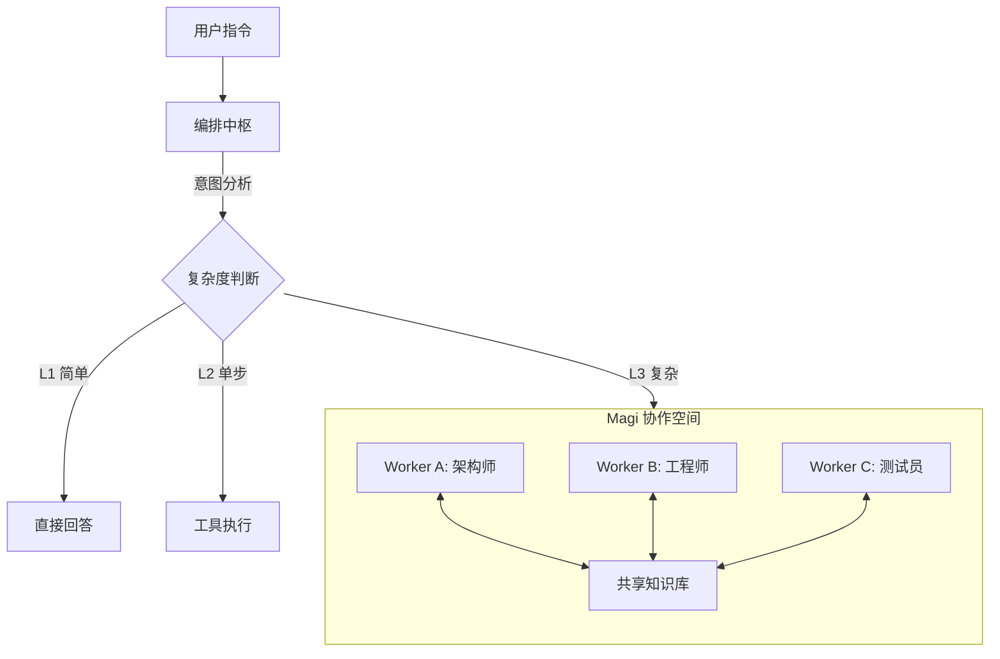

# 🔮 Magi

**新一代多智能体工程编排系统**

*意图洞察 · 深度拆解 · 异构协作*

 

 

**Magi 不是另一个 ChatBot，而是你的 AI 研发团队。**

它运行在 VSCode 中，将复杂的工程任务自动拆解，指挥多个异构 AI 专家（Worker）并行协作， 从需求分析到代码实现，交付完整的工程成果。

[核心特性](#核心特性) • [工作原理](#工作原理) • [快速开始](#快速开始) • [联系我们](#联系我们)

---

## 

现有的 AI 编程助手（Copilot, Cursor, Cline 等）大多是 **单体智能（Single-Agent）**。当面对复杂的真实工程场景时，它们往往力不从心：

|  |  |  |
|:---|:---|:---|
| **任务迷航** | 上下文窗口受限，长对话后容易"遗忘"初衷，输出质量衰减。 | **独立上下文**：自动拆解任务，每个 Worker 专注单一子任务，**上下文纯净隔离**。 |
| **能力单一** | 强制使用单一模型，无法兼顾逻辑推理、代码生成和架构设计的不同需求。 | **异构模型槽位**：支持 Claude/GPT/Gemini 混合编排，让**最擅长的模型做最擅长的事**。 |
| **效率瓶颈** | 线性串行执行：写代码 → 改 Bug → 写测试，一步步排队等待。 | **并行执行引擎**：无依赖任务**自动并行**，测试与开发同步进行，效率倍增。 |
| **回滚困难** | 一旦改错，往往需要复杂的 Git 操作或手动撤销，容易弄丢代码。 | **快照系统**：内置**任务级文件快照**，每一步变更均可独立回溯，安全无忧。 |
| **协作断层** | 对话结束后上下文即丢失，无法积累项目知识和历史经验。 | **知识沉淀**：跨 Worker 共享上下文 + **项目级知识库**，让 AI 越用越懂你的项目。 |

---

## 

> **Magi 的核心理念：** "用正确的模型，做正确的事。"

你只需要用自然语言描述目标（例如："帮我实现一个带 JWT 验证的登录接口"），Magi 将自动接管后续流程：

> [!TIP]
> **意图理解 ➔ 复杂度评估 ➔ 任务规划 ➔ 专家分派 ➔ 并行执行 ➔ 结果验收 ➔ 成果汇报**

你不再是 AI 的"提示词工程师"，而是 AI 团队的"技术总监"。

---

## 

### 1. 三层自适应执行模型
Magi 不会滥用算力。它根据任务复杂度智能选择执行路径，既保证效果又节省成本。

- **L1 · 即时响应**：针对简单的代码解释，**秒级回复**，零等待。
- **L2 · 工具直达**：针对测试运行、搜索等操作，直接调用**内置工具链**，一步到位。
- **L3 · 全链路协作**：针对复杂需求，自动启动**多 Agent 协作流**，实现任务的深度解耦。

### 2. 异构 Worker 矩阵
Magi 提供 3 个可高度定制的 Worker 槽位。你可以根据模型特长构建你的"梦之队"：

<table>
<tr>
<td align="center" width="33%"><b>🧠 架构与规划</b> (e.g., Claude 3.5 Sonnet)  <i>擅长：系统设计、逻辑分析、方案评审</i></td>
<td align="center" width="33%"><b>🎨 前端与文本</b> (e.g., Gemini 2.0 Pro)  <i>擅长：UI/UX 实现、文档撰写、创意生成</i></td>
<td align="center" width="33%"><b>🛠 排查与修复</b> (e.g., GPT-4o-mini)  <i>擅长：Bug 修复、代码重构、测试补全</i></td>
</tr>
<tr>
<td colspan="3" align="center">

</td>
</tr>
</table>

### 3. 企业级协作流
- **契约机制 (Contracts)**：Worker 之间自动约定接口规范，确保**前后端无缝对接**。
- **任务书 (Assignments)**：每个 Worker 接收包含上下文、**文件快照**和验收标准的任务书。
- **知识共享 (Knowledge Sharing)**：跨 Worker **自动同步**关键变量与变更，彻底消除信息孤岛。

### 4. 强大的工具箱
开箱即用 **15+ 生产力工具**，并支持无限扩展：
- **基础能力**：终端可视化、文件读写、正则/语义搜索、Git 管理、提示词增强。
- **网络能力**：联网搜索、网页抓取。
- **无限扩展**：完整支持 **MCP (Model Context Protocol)** 协议；支持自定义 **Skills** 工作流。

---

## 

只需几步，即可在 VSCode 中拥有你的 AI 研发团队：

1.  **安装扩展**
    *   从 Release 页面下载最新的 `.vsix` 安装包。
    *   在 VSCode 中运行命令：`Extensions: Install from VSIX...` 并选择文件。

2.  **配置大脑 (Orchestrator)**
    *   打开 Magi 设置面板。
    *   配置 **Orchestrator**：这是系统的"大脑"，负责统筹规划。建议使用能力最强的模型（如 Claude 3.5 Sonnet 或 GPT-4o）。

3.  **组建团队 (Workers)**
    *   配置至少一个 **Worker**。
    *   你可以为不同的槽位设置不同的模型 API，利用不同模型的特长（和成本优势）。

4.  **开始协作**
    *   快捷键 `Ctrl+Shift+M` (Mac: `Cmd+Shift+M`) 唤起 Magi 面板。
    *   输入你的需求，例如："帮我重构一下 `/src/utils` 下的日期处理函数，并补充单元测试"。
    *   坐下来，看 Magi 表演。

---

## 

Magi 基于现代化的技术栈构建，确保高性能与可扩展性：

*   **Core**: TypeScript, VSCode Extension API
*   **UI**: Svelte, TailwindCSS (Concept)
*   **Build**: esbuild
*   **AI**: OpenAI API Standard, Anthropic API, Google Gemini API
*   **Protocol**: Model Context Protocol (MCP)

---

## 

Magi 的诞生离不开早期支持者的帮助。

  <table border="0">
    <tr>
      <td align="center" style="border: none;">
        
         
        <b>Poonwai</b>
      </td>
      <td align="center" style="border: none;">
        
         
        <b>agassiz</b>
      </td>
      <td align="center" style="border: none;">
        
         
        <b>StoneFancyX</b>
      </td>
    </tr>
  </table>

*   **Token支持**: [BinCode 中转站](https://newapi.stonefancyx.com/)

---

## 

无论是功能建议、Bug 反馈还是商务合作，欢迎随时交流。

  <table border="0">
    <tr>
      <td align="center" style="border: none; vertical-align: middle;">
        
         
        如有问题或需商务合作 请联系个人微信
      </td>
      <td align="center" style="border: none; vertical-align: middle;">
        
         
        想要抢先体验的同学 请扫码加微信进群
      </td>
    </tr>
  </table>

---

## 

本项目采用 **双重授权协议 (Dual Licensing)**：

1.  **开源授权**：本项目核心代码采用 [GNU GPL v3](LICENSE) 协议。这意味着您可以免费使用、修改和分发代码，但如果您基于此项目开发新软件并分发，您的项目也必须保持开源并采用 GPL 协议。
2.  **商业授权**：如果您不希望受到 GPL 协议的限制（例如：将代码集成到闭源的商业产品中，或不愿公开您的源代码），您可以购买商业授权。

**如有商业授权需求或任何疑问，请联系作者：**

*   **WeChat**: MistRipple

*   **GitHub**: [MistRipple](https://github.com/MistRipple)
